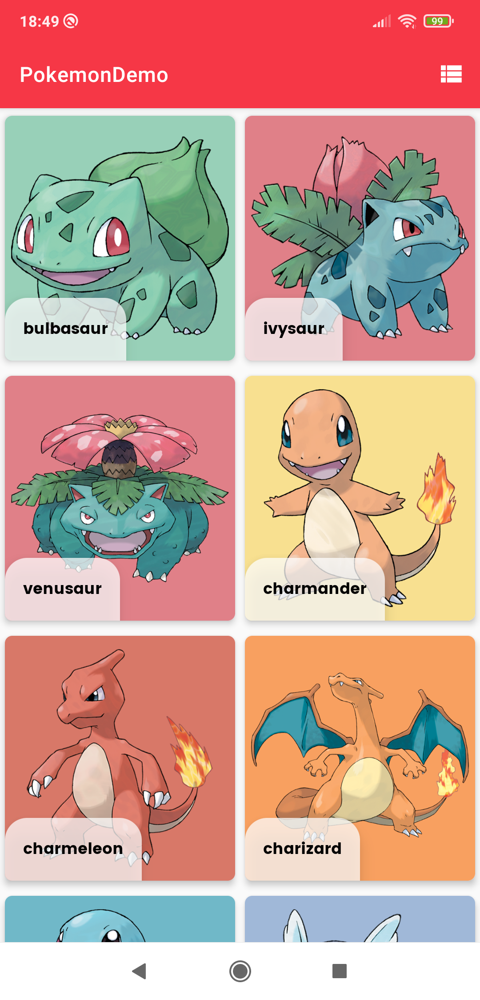
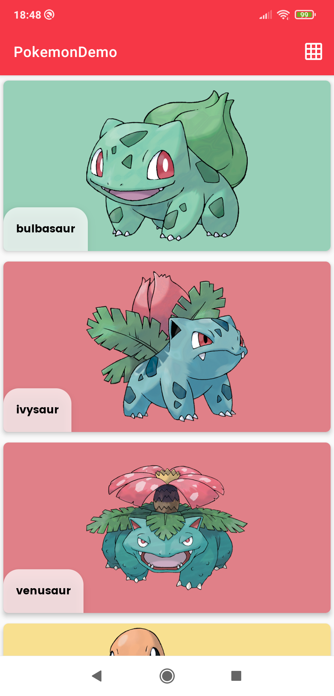
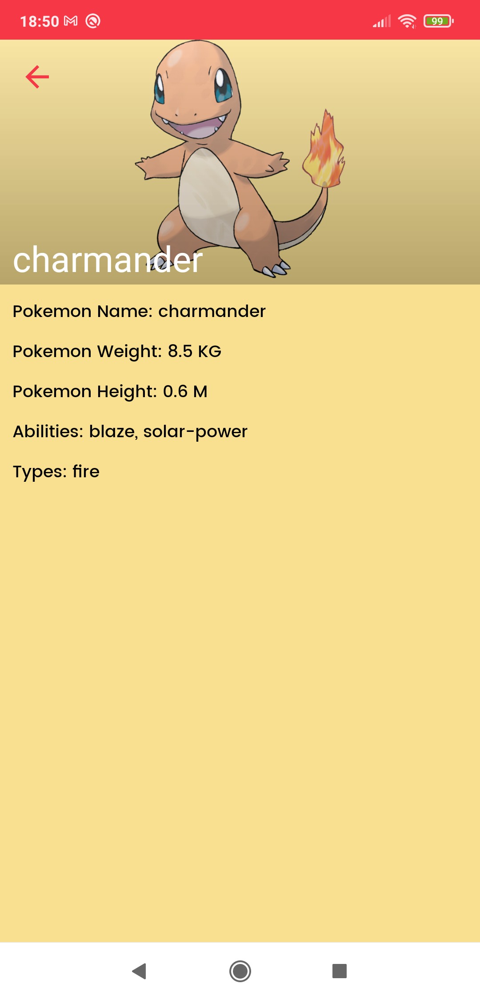

# PokemonDemo
 This is Pokemon Api demo App
 
 - [Pokemon listing API](https://pokeapi.co/api/v2/pokemon?limit=20&offset=0)
 - [Pokemon Detail API](https://pokeapi.co/api/v2/pokemon/bulbasaur)
 - [Pokemon Image API](https://pokeres.bastionbot.org/images/pokemon/1.png)
 
 ## Activities
 - MainActivity - Listing pokemon
 - DetailActivity - Details of selected Pokemon
 
 ## Tech stack & Open-source libraries
 - Minimum SDK level 23
 - [Kotlin](https://kotlinlang.org/) and [Java](https://www.java.com/en/) based, 
 - [Coroutines](https://github.com/Kotlin/kotlinx.coroutines) for asynchronous.
 - Dagger dependency injection.
 
 - JetPack
   - LiveData - notify domain layer data to views.
   - Lifecycle - dispose of observing data when lifecycle state changes.
   - ViewModel - UI related data holder, lifecycle aware.
   
 - Architecture
   - MVVM Architecture (Model View ViewModel - DataBinding)
   - Repository Design Pattern
  
 - [Retrofit2 & OkHttp3](https://github.com/square/retrofit) - construct the REST APIs and paging network data.
 - [HttpInterceptor](https://github.com/square/okhttp/tree/master/okhttp-logging-interceptor) - An OkHttp interceptor which logs HTTP request and response data.
 - [Gson](https://github.com/google/gson) - A modern JSON library for Kotlin and Java.
 - [Picasso](https://github.com/square/picasso) - loading images.
 - [Picasso Palette](https://github.com/florent37/PicassoPalette) - color background palette.
 - [ShimmerView](https://github.com/facebook/shimmer-android) - Shimmer Loading View.
 - [SwipeToRefreshLayout](https://developer.android.com/jetpack/androidx/releases/swiperefreshlayout) - implement swipe to refresh layout.
 - [Timber](https://github.com/JakeWharton/timber) - logging.
 - [Material-Components](https://github.com/material-components/material-components-android) - Material design components like ripple animation, cardView.
 - Custom Views
 - [CircularProgressView](https://github.com/rahatarmanahmed/CircularProgressView) - A polished and flexible CircleProgressView, fully customizable with animations.

## Images

```MainActivity : Grid```





```MainActivity : List```





```DetailActivity```





## Gif

